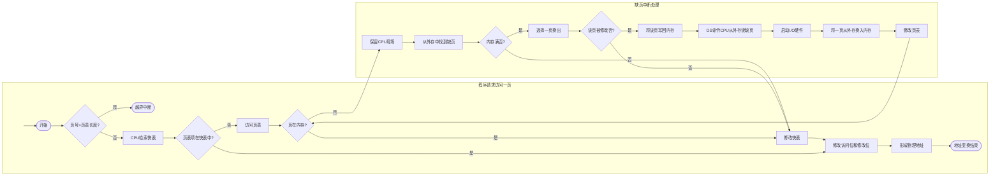

---
{"dg-publish":true,"dg-permalink":"408/操作系统/内存管理","permalink":"/408/操作系统/内存管理/","dgHomeLink":true,"dgPassFrontmatter":false}
---

# 概念
- 内存管理的主要功能
	- 内存空间的分配和回收
	- 地址转换
	- 内存空间的扩充
	- 内存共享
	- 存储保护

- 程序的连接与装入
	- 编译：编译程序将用户源代码编译成若干目标模块
	- 链接：链接程序将编译后形成的一组目标模块与所需库函数链接在一起，形成一个完整的装入模块
		- 链接三种方式
			- 静态链接
				- 运行前，将各目标模块及所需库函数连接成完整装配模块
				- 需要修改相对地址，从编译后形成的从0开始的相对地址到新地址
				- 每个模块所用的外部调用符号也变换为相对地址
			- 装入时动态链接（动态链接）
				- 得到的目标模块再装入时边装入边链接
				- 便于修改和更新，便于实现对目标模块的共享
			- 运行时动态链接（动态加载）
				- 程序执行中需要目标模块时才链接
				- 加快程序装入过程，节省大量内存空间
	- 装入：装入程序将装入模块载入内存运行
		- 装入三种方式
			- 绝对装入
				- 只适用于单道程序环境
				- 预知程序在内存的位置，编译程序产生绝对地址目标代码，装入程序按装入模块中地址装入
				- 逻辑地址=实际地址
				- 绝对地址可在汇编，编译，程序员编写代码时给出
				- 程序中符号地址$\Rightarrow$编译汇编后绝对地址
			- 可重定位装入/静态重定位
				- 多道程序环境下
				- 目标模块起始地址从0开始，装入时选择合适位置，修改目标程序中指令与数据地址
				- 一次性为作业分配内存，不能部分装入，移动或申请新空间
			- 动态运行时装入/动态重定位
				- 装入程序将装入模块装入内存后，将相对地址到绝对地址的转换推迟到程序真正执行的时候
				- 需要重定位寄存器的支持
				- 优点：可分配不连续存储区，程序运行前只需装入部分代码即可执行，动态申请分配内存，利于程序段共享
- 逻辑地址与物理地址
	- 相对地址/逻辑地址：编译后，各个目标模块从0单元开始编址
	- 逻辑地址空间：链接程序将目标链接成可执行目标程序，按各个模块的相对位置统一从0单元编址
	- 物理地址空间：内存中物理单元的集合，最终地址
	- 地址重定位：逻辑地址$\Rightarrow$物理地址
- 进程的内存映像
	- 代码段：程序的二进制代码，只读，可共享
	- 数据段：全局变量和静态变量
	- 进程控制块 PCB：存放在系统区
	- 堆：存放动态分配变量，向高地址分配
	- 栈：实现函数调用，从用户空间最大地址往低地址增长
- 内存保护
	- 目的：每个进程有单独的内存空间，操作系统不受用户进程影响，用户进程不受其他用户进程影响
	- 方式：
		- CPU中设置一对上下限寄存器，存放作业在主存的下限和上限地址，供越界判断
		- 使用重定位寄存器/基地址寄存器和限长寄存器/界地址寄存器，重定位寄存器含最小物理地址值，界地址寄存器含逻辑地址最大值，内存管理机构负责比较判断逻辑地址合法性和地址映射并交付内存单元
- 内存共享
	- 可重入代码：允许多个进程同时访问但不允许被任何进程修改的纯代码

# 内存管理方式
- \*覆盖
	- 把用户空间分为
		- 固定区：经常活跃内容
		- 覆盖区：将访问段
		- 其余段在外存，需时覆盖
- \*交换
	- 等待状态程序换出，准备好竞争处理机的程序换入

## 连续分配管理方式
- 给用户程序分配连续空间
- 分类
	- 单一连续分配
		- 单道
		- 内存分为
			- 系统区：仅供操作系统使用，低地址
			- 用户区：一个用户程序独占
		- 优点：简单，无外部碎片，无需内存保护（内存中只有一个程序）
		- 缺点：单用户单任务，有内部碎片，存储器利用率低
	- 固定分区分配
		- 最简单的多道程序存储管理
		- 分区方法
			- 等大小：不灵活
			- 不等大小：多小适中少大
				- 程序太大放不进：用覆盖技术
				- 程序小于固定大小：内部碎片
		- 分区使用表
	- 动态分区分配/可变分区分配
		- 分区大小数目可变
		- 外部碎片：用紧凑技术移动整理内存，需要动态重定位寄存器
		- 分配策略
			- 首次适应：空闲分区按地址递增次序链接，链首开始查找，取第一个合适大小空闲分区分配
				- 最简单，最好，最快
			- 邻近适应/循环首次适应：类首次，从上次结束位置开查
				- 较差
			- 最佳适应：空闲分区按容量递增串成链，找恰好满足空闲分区分配
				- 很差，最多的外部碎片
			- 最坏适应：容量递减串链，找首个满足要求的割一块
				- 大内存片少，差
	- 过程
		- 分配：查动态分区链表，大了割 
		- 回收：
			- 前面也空闲：合并，修改动态分区链表中的大小
			- 后面也空闲：合并，修改动态分区链表中的基址和大小
			- 前后都空闲：合并，修改动态分区链表中前项大小，删除后项
			- 都不空闲：新增动态分区链表项，填基址和大小，插入链

## 基本分页存储管理
- 尽量避免碎片的产生

### 概念
- 页
	- 页/页面：进程中的块
	- 页框/页帧：内存中的块
	- 块/盘块：外存中的块
	- 页面的大小要合适
		- 过大：页内碎片多，内存利用率降低
		- 过小：进程页面数过多，页表过长占内存，增加地址转换开销
- 地址结构
	
	| 页号 P | 页内偏移量 W |
	| ------ | ------------ |
	- 决定虚拟内存的寻址空间
- 页表
	- 记录页面在内存中对应的物理块号

### 基本地址变换机构
-

- PTR 页表寄存器
	- 存放页表在内存的起始地址F和页表长度M
	- 进程执行时才将PCB内所存的内存起始地址和页表长度调入
- 逻辑地址A$\Rightarrow$物理地址E(硬件完成)
	- 设页面大小为L
	- 页号 P = A / L，页内偏移量 W = A % L
	- 比较页号P和页表长度M
		- 若P >= M，产生越界中断
	- 页表内页号P所对应的页表项地址 = 页表始址F + 页号P * 页表项长度
	- 取出页表对应的物理块号b
	- E = b * L + W

### 具有快表的地址变换机构
- 页表存放在内存中，取一条指令或一个数据至少访问两次内存
- 快表 TLB/相联存储器
- 

- 逻辑地址A$\Rightarrow$物理地址E
	- CPU给出逻辑地址，硬件进行地址转换，页号送入Cache，页号与快表比较
		- 匹配，直接去处对应页框号，与页内偏移量拼接成物理地址，一次访存
		- 未匹配，访问主存页表，读出按一定算法存入快表
	- 可快满表同时查找，先到先得

### 两集页表
- 顶级页表最多只能有一个页面
- 逻辑地址结构
	
	| 一级页号 | 二级页号 | 页内偏移 | 
	| -------- | -------- | -------- |

## 基本分段存储管理
- 分页管理：从计算机角度设计，提高内存利用率，提升性能
	分段管理：从用户和程序员角度设计，满足编程，信息保护共享，动态增长，动态链接等需要
- 分段：
	- 按用户进程中的自然分段划分
	- 每段从0开始编址，分配连续地址空间
	- 逻辑地址结构

		| 段号 S | 段内偏移量 W | 
		| ------ | ------------ |
- 段表结构
	
	| 段号 | 段长 | 本段在主存的地址 |
	| ---- | ---- | ---------------- |
- 地址变换机构
	- 与页表类似
- 共享
	- 通过作业段表相应项指向共享段同一副本实现
	- 纯代码/可重入代码：不能修改，可共享
		- 可修改代码和数据不能共享
- 保护
	- 存取控制保护
	- 地址越界保护
		- 分段管理地址空间是二维的（段长不定）

## 段页式管理
- 作业地址空间被分为若干逻辑段
- 每个段分为若干固定大小的页
- 内存空间管理与分页存储管理相同
- 逻辑地址组成
	
	| 段号 S | 页号 P | 页内偏移量 W |
	| ------ | ------ | ---------- |
- 地址变换
	- 段页式管理的地址空间是二维的
	- 每个进程一张段表（段号，页表长度，页表始址）
	- 每个分段一张页表（页号，块号）
	- 段表寄存器
		- 指出段表始址和段表长度
		- 寻址+判断越界
	- 

# 虚拟内存管理
- 传统存储管理方式
	- 一次性：作业一次性全部装入后才开始运行
		- 作业装不进，无法运行
		- 很多作业，只能先运行少数，多道程序度下降
	- 驻留性：作业装入内存后不换出，直至运行结束
		- 进程可能处于等待浪费空间
- 局部性原理 [[408/计组/存储系统#^47849f|存储系统#^47849f]]
	- 时间局部性
		- 近来使用指令与数据存入高速缓存，层次结构
	- 空间局部性
		- 较大高速缓存，预存取机制集成到高速缓冲控制逻辑
- 虚拟存储器
	- 系统提供了对用户透明的部分装入，请求调入和置换功能后，容量似乎大于实际物理内存的逻辑存储器
	- 特征
		- 多次性
			- 最重要特征
		- 对换性
		- 虚拟性
			- 最重要特征，最重要目标

## 虚拟内存技术的实现
- 实现方式
	- 请求分页存储管理
	- 请求分段存储管理
	- 请求段页式存储管理
- 硬件支持
	- 一定容量的内存和外存
	- 页/段表机制作为主要数据结构
	- 中断机构
	- 地址变换机构

### 请求分页管理方式
- 请求页表项
	
	| 页号 | 物理块号 | 状态位 P | 访问字段 A | 修改位 M | 外存地址 |
	| ---- | -------- | -------- | ---------- | -------- | -------- |
	- 状态位 P：指示该页是否调入内存，P=0$\Rightarrow$物理块号全为0
	- 访问字段 A：记录本页在一段时间内被访问的次数/多久未被访问，供置换算法参考
	- 修改位 M：标识该页调入内存后是否被修改过，确定置换时是否写回
	- 外存地址：外存地址，通常为物理块号，调入时参考
- 缺页中断机构
	- 缺页进程阻塞，按规则调入新页，唤醒进程
	- 作为中断的特点
		- 在指令执行期间产生处理中断信号，为内部异常
		- 一条指令执行期间可能产生多次缺页中断
- 地址变换机构

### 页框分配
- 驻留集：一个进程分配的物理页框的集合就是该进程的驻留集
	- 分配得少，驻留主存的进程多，提高CPU利用率
	- 过少，缺页率高
	- 过多，对缺页率不会有太大改善
	- 内存分配策略
	- 固定分配局部置换
		- 难以确定为每个进程分配的物理块数
			- 太少：频繁缺页
			- 太多：降低CPU和其他资源利用率
	- 可变分配全局置换
		- 灵活
		- 盲目给进程增加物理块，并发性下降
	- 可变分配局部置换
		- 控制缺页率，维持多道程序并发能力
		- 实现复杂，开销大，但很值
- 物理块调入算法
	- 平均分配算法
	- 按比例分配算法
	- 优先权分配算法
	- 通常把所有可分配物理资源分为两部分，一部分按比例分配，一部分根据优先权
- 调入页面的时机
	- 预调页策略
		- 一次调入若干相邻的页
		- 主要用于进程首次调入，由程序猿指出
	- 请求调页策略
		- 易实现
		- 一次一页，增加磁盘I/O开销
- 页面来源
	- 请求分页系统中外存分为
		- 存放文件的文件区
		- 存放对换页面的对换区
	- 系统拥有足够对换区空间
		- 全从对换区换
		- 需要在进程运行前讲进程相关文件全部从文件区复制至对换区
	- 系统缺少足够对换区空间
		- 不修改的文件从文件区调，不必换出
		- 可能修改的文件换出至对换区，需时再调入
	- UNIX方式
		- 未运行的页面从文件区调
		- 运行又换出至对换区的页面从对换区调
		- 共享页面被多个进程调入只需调入一次

### 页面置换算法
- 最佳置换算法 OPT
	- 淘汰以后永不使用的页面/最长时间内不被访问的页面
	- 理想的，最佳的，客观的，公正的

