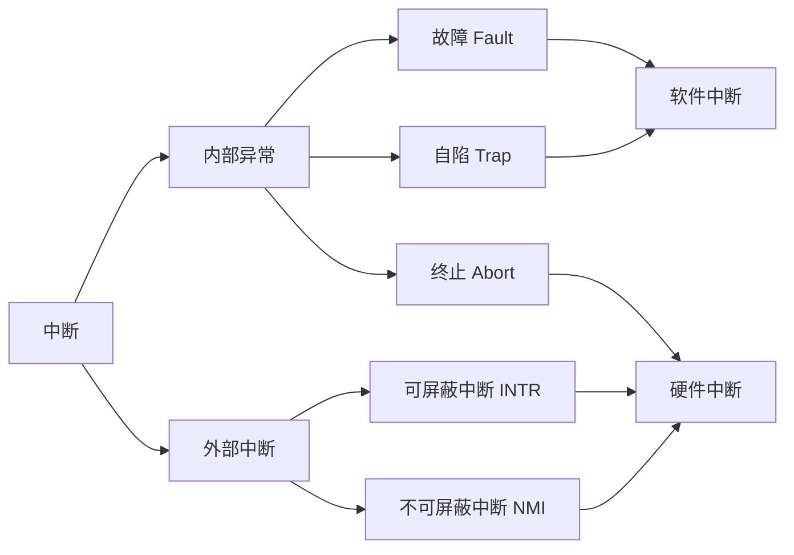

---
{"dg-publish":true,"dg-permalink":"408/操作系统/计算机系统概述","permalink":"/408/操作系统/计算机系统概述/","dgHomeLink":true,"dgPassFrontmatter":false}
---


# 基本概念
- 计算机系统四部分：
	- 硬件：提供基本计算资源
	- 操作系统：协调用户应用程序对资源的分配使用
	- 应用程序：解决用户计算问题
	- 用户
- 操作系统：控制和管理整个计算机系统的硬件与软件资源，合理组织调度计算机工作与资源的分配，进而为用户和其他软件提供方便接口与环境的程序集合

## 并发
- 操作系统处理调度多个程序同时执行
- （单核）宏观"并行"，微观串行
	- 不同于同一时刻的并行，微观仍为串行，由<mark style="background: #FF5582A6;">分时</mark>实现
	- 真正的并行需要硬件的支持

# 共享
- 类型
	- 互斥共享
		- 一段时间允许一个进程
	- 同时访问
		- 宏观同时，微观分时访问
- 虚拟：逻辑模拟物理实体
```ad-caution
- 并发与共享是操作系统最基本的特征
- 两者互为存在条件：
	- 资源共享需要并发来实现
	- 资源共享管理不合理影响并发执行
```

## 虚拟
- 把物理实体变为逻辑对应物
- 操作系统内有
	- 虚拟处理器
		- 多道程序设计技术
		- 一个物理CPU$\implies$多个逻辑CPU
	- 虚拟内存
	- 虚拟外部设备
		- 临界资源$\implies$多用户同时访问
- 操作系统虚拟技术：
	- 时分复用
	- 空分复用

## 异步
- 进程异步性：多道系统下程序因有限资源产生的运行速度不连贯


# 操作系统的目标与功能

## 作为系统资源管理
- 处理机管理
	- 多道程序环境下即进程管理
- 存储器管理
	- 为多道程序运行提供环境，方便使用，提高内存使用率
- 文件管理
	- 计算机中的信息都是以文件的形式存在的
- 设备管理
	- 处理用户的I/O请求，方便设备使用，提高利用率

## 作为用户与硬件间接口
- 命令接口
	- 联机命令接口/交互式命令接口
		- 分时系统/实时系统
		- 强交互性
		- e.g. shell之类的命令解释器
	- 脱机命令接口/批处理命令接口
		- 批处理系统
		- 批处理
- 程序接口
	- 由一组系统调用组成
		- <mark style="background: #FF5582A6;">系统调用即广义指令</mark>
	- 用户在程序中使用系统调用来请求操作系统为其服务

## 作为对计算机资源的扩充
- 无软件支持的计算机：裸机
- 覆盖软件的机器：扩充机器/虚拟机
 
# 操作系统发展历程
- 手工操作阶段：无操作系统
	- 用户独占全机
	- CPU等待手工利用不充分
- 批处理阶段：出现操作系统
	- 单道批处理系统
		- 自动性，顺序性，单道性
		- 高速CPU等低速I/O
	- 多道批处理系统
		- 多道，宏观并行（也算是并行...乌鱼），微观串行
		- 资源利用率高，系统吞吐量大
		- 用户响应时间长，不提供人机交互
- 分时操作系统
	- 同时性/多路性，交互性，独立性，及时性
	- 无法保证在规定时间内处理
- 实时操作系统
	- 硬/软实时系统
- 网络操作系统和分布式计算机系统
- 个人计算机操作系统

# 操作系统运行环境
- 通常CPU执行两种不同性质的程序：内核程序和应用程序
- 指令按权限分类：
	- 特权指令：不允许用户直接使用
		- I/O，置终端，存取用于内存保护的寄存器，送值至状态寄存器
	- 非特权指令：允许用户直接使用
		- 不能直接访问系统软硬件资源，仅限于访问用户地址空间
- 处理器运行模式：
	- 用户态/目态 1
	- 核心态/管态/内核态 0
## 内核包含内容
- 时钟管理
	- 最关键的设备
	- 功能：计时，进程切换
- 中断机制
	- 现代操作系统是靠中断驱动的软件
	- 仅保护恢复中断现场属于内核
- 原语
	- 是一种程序
	- 操作系统最底层，最接近硬件
	- 程序具有原子性
	- 运行时间短，调用频繁
- 系统控制的数据结构及处理
	- 数据结构：作业控制块，PCB，设备控制块，链表，消息队列，缓冲区，空闲区登记表，内存分配表
	- 操作：进程管理，存储器管理，设备管理

## 中断与异常
- 中断是切换运行模式的唯一途径
- 中断/外中断：CPU指令外部事件
	- 信息输入输出，I/O结束，时钟中断
- 异常/内中断：CPU指令内部事件
	- 非法操作码，地址越界，溢出，缺页，专门的陷入指令
- 分类


- 通常情况下，中断和异常的具体处理由操作系统完成

## 系统调用
- 分类
	- 设备管理
	- 文件管理
	- 进程控制
	- 进程通信
	- 内存管理
- 用户通过陷入 Trap 发起系统调用$\Rightarrow$状态切换，CPU使用权交到内核$\Rightarrow$系统处理$\Rightarrow$状态切换，CPU使用权交到用户程序
- 用户态$\Rightarrow$核心态：
	- 系统调用
	- 中断
	- 用户程序出现错误状态
	- 用户程序企图执行特权命令
- 核心态$\Rightarrow$用户态：
	- 特权指令，一般是中断返回指令
```ad-caution
用户态到核心态需要状态转换，堆栈可能也需要从用户堆栈切换到系统堆栈，系统堆栈也属于该进程
```
- 用户态到核心态会用到访管命令，为非特权命令

# 操作系统结构
- 分层法
	- 最底层为硬件，最高曾为用户接口
	- 上一层只能调用下一层的功能服务
	- 优点：便于验证，实现，扩展，维护
	- 缺点：难以定义，效率低（执行功能往往需要穿越多层）
- 模块化
	- 模块+接口
	- 模块大小要合适
		- 模块太小：联系过多系统混乱
		- 模块太大，模块内部复杂
		- 标准为内聚性与耦合度
	- 优点：提高系统正确性，可理解性，可维护性，可适应性，加快开发
	- 缺点：接口规定难以满足实际需求，模块设计没有可靠的决定顺序
- 宏内核/单内核/大内核
	- 按内核架构分，操作系统分为宏内核和微内核
	- 系统的主要功能模块都作为一个紧密联系的整体运行在核心态
	- 割管理模块共享信息，有效利用相互之间有效特性，性能高
- 微内核
	- 内核中最基本功能留在内核，其他功能移到用户态，降低设计复杂性
	- 微内核操作系统组成：C/S架构
		- 微内核：
			- 运行于内核态
			- 精心设计，能实现操作系统最基本核心功能的小型内核
			- 与硬件处理关系密切的部分
			- 较基本功能
			- 客户与服务器的通信
		- 服务器
			- 运行于用户态
			- 移出原内核的功能
			- 作为进程实现
			- 通过微内核提供的消息传递机制交互
			- 崩溃不影响内核
	- 基本功能：机制与策略分离
		- 进程/线程管理
		- 第几存储器管理
		- 中断与陷入管理
	- 优点：灵活易扩展，可靠安全，可移植性，支持分布式计算
	- 缺点：频繁切换运行模式，系统执行开销大
- 外核
	- 机器分区，外核为虚拟机分配资源
	- 优点：无需再次映射，将外核的多道程序与用户空间的用户操作系统代码分离

# 操作系统引导
- 激活CPU，CPU读取ROM中的boot程序，开始执行BIOS
- 硬件自检
- 加载有操作系统的硬盘，BIOS读取Boot Sequence，控制权交给启动顺序第一位的设备
- 加载主引导记录MBR，顺序查找存储设备直至找到引导硬盘
- 扫描硬盘分区表，查找加载活动分区
- 加载分区引导记录PBR，读取活动分区第一个扇区，寻找启动管理器
- 加载启动管理器
- 加载操作系统

# 虚拟机
- 逻辑计算机
- 利用特殊的虚拟化技术，隐藏实际物理特性，为用户提供抽象统一模拟的计算环境
- 第一类虚拟机管理程序（裸金属架构）
	- 类操作系统
	- 唯一运行在最高特权级的程序
	- 向上提供虚拟机，每台虚拟机都是完全一致的裸机
	- 虚拟机有虚拟内核态
	- 不支持虚拟化的CPU将敏感指令转化为对虚拟机管理程序的调用
- 第二类虚拟机管理系统（寄居架构）
	- 类进程
	- 依赖于其他操作系统分配调度资源
	- 下层：宿主操作系统
	上层：客户操作系统


# NOTICE！
- 库函数运行在用户空间，系统调用运行在内核
- 中断技术使得多道批处理系统的I/O设备和CPU可并行（进程切换）