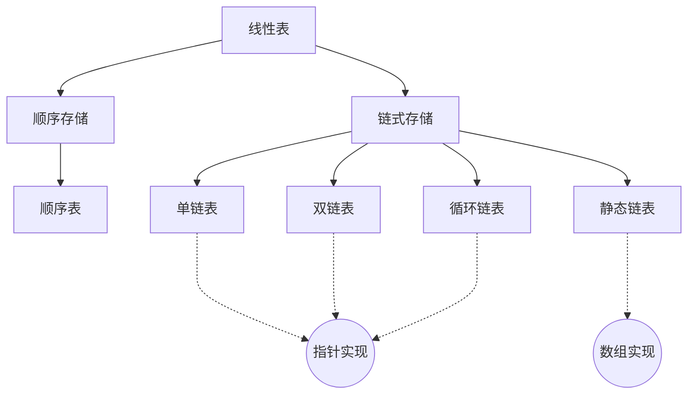

---
{"dg-publish":true,"dg-permalink":"408/数据结构/线性表","permalink":"/408/数据结构/线性表/","dgHomeLink":true,"dgPassFrontmatter":false}
---

- 顺序表操作：
	- 插入：$O(n)$
	- 删除：$O(n)$
	- 查找：
		- 按序号：$O(1)$
		- 按值：$O(n)$
	- \*逆转：$O(n)$
		- 用于顺序表的局部换序或整体换序

- 链表操作：
	- 插入：$O(n)$
	- 删除：$O(n)$
	- 查找：
		- 按序号：$O(n)$
		- 按值：$O(n)$
	- 建表：
		- 头插：$O(n)$
		- 尾插：$O(n)$
	- 删除表：$O(n)$
