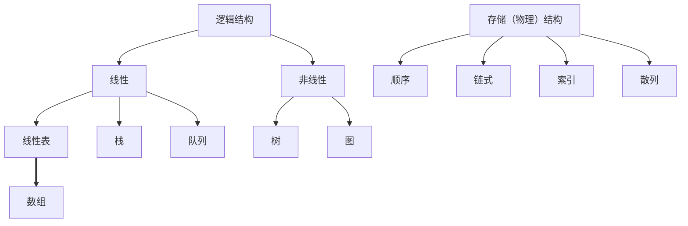

---
{"dg-publish":true,"dg-permalink":"408/数据结构/绪论","permalink":"/408/数据结构/绪论/","dgHomeLink":true,"dgPassFrontmatter":false}
---

- 数据的分类

```mermaid
flowchart
	逻辑结构 --> 线性
	逻辑结构 --> 非线性 
	线性 --> 线性表 ==> 数组
	线性 --> 栈 & 队列
	非线性 --> 树 & 图
	temp["存储（物理）结构"] --> 顺序 & 链式 & 索引 & 散列
```
