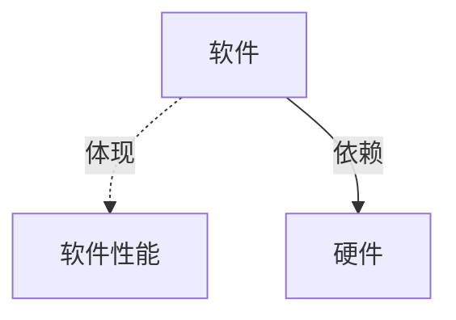

---
{"dg-publish":true,"dg-permalink":"408/计组/计算机系统概述","permalink":"/408/计组/计算机系统概述/","dgHomeLink":true,"dgPassFrontmatter":false}
---

- 一些功能软硬件逻辑等效

# 硬件

## 冯诺伊曼机
- 

- 特点
	- 存储程序
	- 五大部件
	- 指令数据同地位，同形式存储
	- 指令数据二进制表示
	- 指令=操作码+地址码
	- 运算器为中心

## 功能部件
- 输入设备
	- 将数据与程序以<mark style="background: #FF5582A6;">机器能识别和接受的信息形式</mark>输入计算机
- 输出设备
- 存储器
	- 存放数据与程序
	- MDR 地址寄存器
	- MAR 数据寄存器
- 运算器
	- 算术运算与逻辑运算
	- 包含寄存器 （<mark style="background: #FF5582A6;">加红</mark> 必须有）
		- <mark style="background: #FF5582A6;">ACC 累加器</mark> 
		- <mark style="background: #FF5582A6;">MQ 乘商寄存器</mark> 
		- <mark style="background: #FF5582A6;">X 操作器寄存器</mark> 
		- IX 变址寄存器
		- BR 基址寄存器
- 控制器