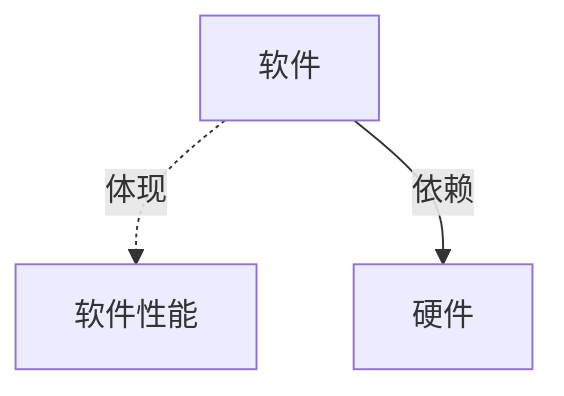
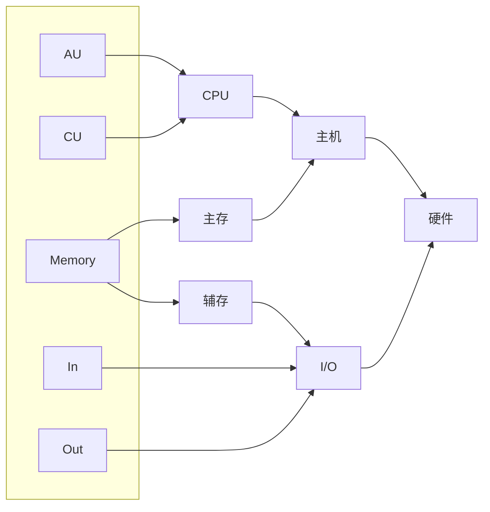

---
{"dg-publish":true,"dg-permalink":"408/计组/计算机系统概述","permalink":"/408/计组/计算机系统概述/","dgHomeLink":true,"dgPassFrontmatter":false}
---

- 一些功能软硬件逻辑等效

# 硬件

## 冯诺伊曼机
- 

- 特点
	- 存储程序
	- 五大部件
	- 指令数据同地位，同形式存储
	- 指令数据二进制表示
	- 指令=操作码+地址码
	- 运算器为中心

## 功能部件
- 输入设备
	- 将数据与程序以<mark style="background: #FF5582A6;">机器能识别和接受的信息形式</mark>输入计算机
- 输出设备
- 存储器
	- 存放数据与程序
	- MDR 地址寄存器 <mark style="background: #ABF7F7A6;">透明</mark> ：（一般情况，不取两次时）位数等于存储字长
	- MAR 数据寄存器 <mark style="background: #ABF7F7A6;">透明</mark> ：位数等于PC
- 运算器
	- 算术运算与逻辑运算
	- 组成
		- 通用寄存器 （<mark style="background: #FF5582A6;">加红</mark> 必须有）
			- <mark style="background: #FF5582A6;">ACC 累加器</mark> 
			- <mark style="background: #FF5582A6;">MQ 乘商寄存器</mark> 
			- <mark style="background: #FF5582A6;">X 操作器寄存器</mark> 
			- IX 变址寄存器
			- BR 基址寄存器
		- PSW(PSWR) 程序状态寄存器（标志寄存器）
- 控制器
	- 指挥中心
	- 组成
		- PC 程序计数器 <mark style="background: #FFB86CA6;">非透明</mark> 
		- IR 指令寄存器 <mark style="background: #ABF7F7A6;">透明</mark> 
		- CU 控制单元
	- 

## 现代计算机
- 

# 软件
- 系统软件：保证计算机系统高效正确运行的基础软件
	- OS，DB<mark style="background: #FF5582A6;">M</mark>S，语言处理程序，分部式软件系统，网络软件系统，标准库程序，服务性程序
- 应用软件：为解决某个应用领域的各种问题而变质的程序
	- 科学计算类程序，工程设计类程序，数据统计与处理程序

# 系统工作原理
- 存储程序
- 从源程序到可执行文件
	- 预处理（宏，头文件……）
	- 编译形成汇编语言源程序
	- 汇编形成二进制文件
	- 链接多个可重定位目标文件与标准库函数合并成可执行文件
- 指令执行过程
	- 格式：(SOMWHERE)$\rightarrow$SOMEWHERE_ELSE
		- 括号代表存放数据
		- 数据流时可省略括号
	- e.g. ALU 
		- 取指令：PC$\rightarrow$MAR$\rightarrow$M$\rightarrow$MDR$\rightarrow$IR
			- PC取完立刻加1，跳转时注意行数
		- 分析指令：OP(IR)$\rightarrow$CU
		- 执行指令：Ad(IR)$\rightarrow$MAR$\rightarrow$M$\rightarrow$MDR$\rightarrow$ACC

# 计算机的性能指标
- 字长/机器字长：
	- 计算机进行一次整数运算所能处理的二进制数据的位数
	- CPU内部用于整数运算的数据通路宽度
	- 用于整数运算的运算器位数
	- 通用寄存器宽度

	- 指令字长和存储器字长都为字长整数倍
	- 计算精度主要因素
- 数据通路带宽：
	- <mark style="background: #FF5582A6;">外部数据总线</mark>（非CPU内部总线）一次能并行发送的信息位数
- 主存容量：
	- 主存储器能存储信息的最大容量
- 运算速度（执行<mark style="background: #FF5582A6;">指令</mark>的速度）：
	- 吞吐量：单位时间处理请求的数量，主要看数据存取速度，取决于主存
	- 响应时间：用户发送请求至系统响应，通常包括CPU时间和等待时间
	- 时钟周期/CPU时钟周期：CPU内最小时间单位
	- 主频/CPU时钟频率
	- CPI：执行一条指令需要时钟周期数，通常为平均值
	- CPU执行时间：运行一个程序所用时间
		- CPU执行时间=CPU时钟周期数/主频=(指令条数$\times$CPI)/主频
	- 三要素：主频，CPI，指令条数
	- MIPS：每秒执行多少<mark style="background: #FF5582A6;">百万</mark>条命令
	- <mark style="background: #ABF7F7A6;">M</mark>FLOPS <mark style="background: #ABF7F7A6;">G</mark>FLOPS <mark style="background: #ABF7F7A6;">T</mark>FLOPS <mark style="background: #ABF7F7A6;">P</mark>FLOPS <mark style="background: #ABF7F7A6;">E</mark>FLOPS <mark style="background: #ABF7F7A6;">Z</mark>FLOPS：每秒执行多少$\times10^{6\ 9\ 12\ 15\ 18\ 21}$次浮点数计算
	- 基准程序：不同应用场合，不同基准程序

# NOTICE!
- 系列机由基本相同的体系结构，指令向后兼容
- 兼容指软硬件通用性
- 将程序固化在ROM的部件称为固件，是具有软件特性的硬件，速度快于软件，灵活性优于硬件
- 数据库系统不是系统软件
- 相联存储器即可按地址寻址又可按内容寻址
- 翻译程序包括编译程序和解释程序
	- 从一种语言到机器可执行文件即为翻译程序
	- 解释程序不生成可执行文件直接逐句 执行