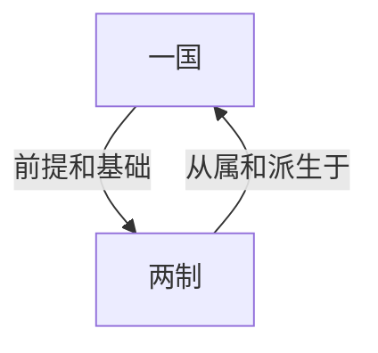

---
{"dg-publish":true,"dg-permalink":"政治/毛中特/习近平新时代中国特色社会主义思想","permalink":"/政治/毛中特/习近平新时代中国特色社会主义思想/","dgHomeLink":true,"dgPassFrontmatter":false}
---

# 习近平新时代中国特色社会主义思想及其历史地位
- 新时代：坐标
- 新思想：灵魂
- 强起来：底色

## 社会历史条件

### 中国特色社会主义进入新时代

#### 新时代标志我国发展新的历史方位

#### $\bigstar$ 社会主要矛盾的变化
- 人民日益增长的美好生活需要和不平衡不充分的发展之间的矛盾
	- 发展中的矛盾和问题集中体现在<mark style="background: #FF5582A6;">发展质量</mark>上

#### 新时代的内涵与意义

##### 内涵
- 从历史脉络看，新时代是承前启后、继往开来、在新的历史条件下继续夺取中国特色社会主义伟大胜利的时代
- 从实践主题看，新时代是决胜全面建成小康社会、进而全面建设社会主义现代化强国的时代
- 从人民性来看，新时代是全国各族人民团结奋斗、不断创造美好生活、逐步实现全体人民共同富裕的时代
- 从民族性来看，新时代是全体中华儿女戮力同心、奋力实现中华民族伟大复兴中国梦的时代
- 从世界性来看，新时代是我国日益走近世界舞台中央、不断为人类作出更大贡献的时代
##### $\bigstar$意义
- 从中华民族复兴的历史进程看，意味着近代以来久经磨难的中华民族迎来了从站起来、富起来到强起来的伟大飞跃，迎来了实现中华民族伟大复兴的光明前景
- 从科学社会主义发展进程看，意味着科学社会主义在 21 世纪的中国焕发出强大生机活力，在世界上高高举起了中国特色社会主义伟大旗帜
- 从人类文明进程看，意味着中国特色社会主义道路、理论、制度、文化不断发展，拓展了发展中国家走向现代化的途径，给世界上那些既希望加快发展又希望保持自身独立性的国家和民族提供了全新选择，为解決人类问题贡献了<mark style="background: #FF5582A6;">中国智慧</mark> 和<mark style="background: #FF5582A6;">中国方案</mark> 。
### 世界正经历百年未有之大变局
- 当前国际格局和国际体系正在发生深刻调整，全球治理体系正在发生深刻变革，国际力量对比正在发生近代以来最具革命性的变化，世界范围呈现出影响人类历史进程和趋向的重大态势
	- 世界经济版图发生的深刻变化前所未有，新兴经济体和发展中国家在世界经济中占据越来越大的份额，世界经济重心加快"自西向东"位移
	- 新一轮科技革命和产业变革带来的新陈代谢和激烈竞争前所未有
	- 国际力量对比发生的革命性变化前所未有
	- 全球治理体系的不话应，不对称前所本有
	- 人类前途命运的休威与共前所未有

### 中华民族伟大复兴正处于关键时期

## 科学体系

### 核心要义
- 坚持和发展中国特色社会主义

### 主要内容
- 十个明确（怎么看）
	- 习近平新时代中国特色社会主义思想最重要，最核心的内容，是其支持作用的"四梁八柱"
- 十四个坚持（怎么办）
	- 新时代坚持和发展中国特色社会主义的基本方略，是落实习近平新时代中国特色社会主义思想的实践要求
- 相互融合、有机统一，系统回答了新时代坚持和发展什么样的中国特色社会主义、怎样坚持和发展中国特色社会主义的问题，体现了习近平新时代中国特色社会主义思想理论与实际相结合、认识论与方法论相统一的鲜明特色

### 理论特质
- 人民至上：人民是历史的创造者，是真正的英雄，
是决定党和国家前途命运的<mark style="background: #FF5582A6;">根本力量</mark> ，人民至上是贯穿习近平新时代中国特色社会主义思想的一根红线
- 历史自觉
- 实事求是
- 问题导向：马克思主义的鲜明特点
- 战略思维
- 斗争精神

## 历史地位

### 当代中国马克思主义，21世纪马克思主义
- 习近平新时代中国特色社会主义思想旗帜鲜明坚持马克思主义，高高举起马克思主义的光辉旗帜
- 把马克思主义作为三个起点：理论起点，逻辑起点，价值起点
- 习近平新时代中国特色社会主义思想与时俱进发展马克思主义，开辟了马克思主义的崭新境界
- 当代最现实最鲜活的马克思主义

### 实现中华民族伟大复兴的行动指南
- 习近平新时代中国特色社会主义思想为新时代坚持和发展中国特色社会主义提供了根本指引
- 习近平新时代中国特色社会主义思想为新时代治国理政提供了基本遵循
- 习近平新时代中国特色社会主义思想为全面从严治党、把党建设成为中国特色社会主义事业的坚强领导核心提供了强大思想武器。实现民族复兴，关键在党

### $\bigstar$建设美好世界的中国智慧和中国方案
- 维护世界和平与安全：
	- 对话而不对抗、结伴而不结盟的国际交往观，倡导共同、综合、合作、可持续的新安全观
	- 推动构建相互尊重、公平正义、合作共赢的新型国际关系
- 促进共同发展：
	- 倡导世界各国加强发展合作，打造国际合作新平合，推动经济全球化朝着更加开放、包容、普惠、平衡、共赢的方向发展
	- 提升全球发展的公平性、有效性、协同性，让发展成果更多更公平地惠及各国人民
- 全球治理：
	- 共商共建共享的全球治理观
	- 开放、融通、互利、共赢的合作观
	- 多边主义核心理念
- 文明交流互鉴：
	- 和平、发展、公平、正义、民主、自由的人类共同价值
	- 平等、互鉴、对话、包容的新型文明观
	- 强调坚持求同存异，加强不同文明交流对话

## 坚持和发展中国特色社会主义的总任务

### 中国梦

#### 中华民族近代以来最伟大的梦想
- 坚持和发展中国特色社会主义的总任务，是实现社会主义现代化和中华民族伟大复兴，在全面建成小康社会的基础上，分两步走在本世纪中叶建成富强民主文明和谐美丽的社会主义现代化强国
- 中国梦是中华民族伟大复兴的形象表达
- 三句诗：
	- 昨天：雄关漫道真如铁
	- 今天：人间正道是沧桑
	- 明天：长风破浪会有时

#### 中国梦的科学内涵
- 本质：国家富强，民族振兴，人民幸福
	- 国家富强，民族振兴是人民幸福的基础和保障
	- <mark style="background: #FF5582A6;">人民</mark> 幸福是国家富强，民族振兴的题中之义和必然要求，<mark style="background: #FF5582A6;">根本</mark> 出发点和落脚点
- 人民是中国梦的主题，是中国梦的创造者和享有者
- 中国梦是国家的梦，民族的梦，每一个中国人的梦
- 中国梦与世界各国人民的美好梦想相通

#### 奋力实现中国梦
- 必须走中国道路，即中国特色社会主义道路
- 必须弘扬中国精神，以爱国主义为核心的民族精神和以改革创新为核心的时代精神
- 必须凝聚中国力量，全国各族人民大团结的力量
- 中华民族伟大复兴是海内中华儿女的共同梦想
- 实干梦想才能成真
- 实现中国梦任重而道远，需要锲而不舍，驰而不息

### 建成社会主义强国的战略安排
- 新"两步走"：
	- 2020-2035年：在全面建成小康社会的基础上，再奋斗15年，基本实现社会主义现代化
	- 2035-本世纪中叶：在基本实现现代化的基础上，再奋斗15年，把我国建成富强民主文明和谐美丽的社会主义现代化强国
- 中国特色社会主义发展是阶段性和连续性的统一

### 建设社会主义现代化国家的战略导向

#### 立足发展新阶段（历史方位$\Rightarrow$现实依据）
- 全面建成小康社会、实现第一个百年奋斗目标标志着我国进入了一个新发展阶段
- 依据：
	- 从理论依据来看，马克思主义是远大理想和现实目标相结合、历史必然性和发展阶段性相统一的统一论者，坚信人类社会必然走向共产主义，但实现这一崇高目标必然经历若干历史阶段，从过渡时期到共产主义第一阶段、共产主义高级阶段。
	- 从历史依据来看，新发展阶段我们党带领人民迎来从<mark style="background: #FFB86CA6;">站起来、富起来到强起来</mark>历史性跨越的新阶段。
	- 从现实依据来看，我们已经拥有开启新征程、实现新的更高目标的雄厚物质基础。

#### 贯彻新发展理念（指导原则$\Rightarrow$行动指南）
- 发展思想的中心是以人民为中心
- 完整、准确、全面贯彻新发展理念：
	- 从根本主旨：人民是我们党执政的最深厚基础和最大底气，是党领导现代化建设的出发点和落脚点，也是新发展理念的"根"和"魂"
	- 从问题导向
	- 从忧患意识
- 完整、准确、全面贯彻新发展理念，必须更加注重共同富裕问题
- 战略基点：扩大内需
- 关键：经济畅通无阻
- 最本质特征：高水平的自立自强

|      |                                                  |                        |
| ---- | ------------------------------------------------ | ---------------------- |
| 创新 | 引领发展的第一动力                               | 发展动力问题           |
| 协调 | 持续健康发展的内在要求，发展的尺度和目标         | 发展不平衡问题         |
| 绿色 | 永续发展的必要条件和人民对美好生活追求的重要体现 | 人与自然和谐共生的问题 |
| 开放 | 国家繁荣发展的必由之路                           | 发展内外联动问题       |
| 共享 | 中国特色主义的本质要求                           | 社会公平正义问题       |

#### 构建新发展格局（路径选择$\Rightarrow$战略选择）
- 国内大循环为主体、国内国际双循环促进的新发展格局
- 背景：
	- 发展进程：两头在外$\Rightarrow$内循环
	- 世界比较：逆全球化
- 关键：经济循环的畅通无阻
- 最本质特征：高水平的自立自强
- 需要：释放内需潜力，实行高水平对外开放

# "五位一体"总体布局

## $\bigstar$实现经济高质量发展

### 坚持习近平经济思想
- 坚持党对经济工作的集中统一领导
- 坚持以人民为中心的发展思想
- 坚持是应把握引领经济发展新常态
- 坚持是市场在资源配置中起决定性作用
- 坚持适应我国经济发展主要矛盾变化完善宏观调控
- 坚持问题导向部署经济发展新战略
- 坚持正确工作策略与方法

### 深化供给侧结构性改革
- 八字方针：巩固、增强、提升、畅通
- 供需与需求对立统一
- 基本手段：
	- 需求侧管理，重在解决总量性问题，短期调控
	- 供给侧管理，重在解决结构性问题，激发经济增长动力
- 推进供给侧结构性改革，关键在于理解结构性：
	- 实体经济结构性供需失衡，金融和实体经济失衡，房地产和实体经济失衡
- 内容：
	- 推进增长动能转换，加快实施创新驱动发展策略
	- 深化要素市场化配置改革，实现由以价取胜向以质取胜的转变
	- 加大人力资源培育力度，更加注重调动和保护人的积极性
		- 知识型，技术型，创新型劳动者
	- 激发各类市场活力，加快建设世界一流企业
		- 毫不动摇巩固发展公有制经济：制度需要
		- 毫不动摇巩固支持引导非公有制经济：发展需要
	- 持续推进"三去一降一补"，优化市场供求结构
		- 去产能，去库存，去杠杆，降成本，不短板

### 建设现代化经济体系
- 既是一个重大理论命题，又是一个重大实践课题
- 内容：
	- 建设创新引领，协同发展的产业体系
		- 科技自立自强：国家发展战略支撑
		- 经济发展着力点：实体经济
	- 建设统一开放，竞争有序的市场体系
	- 建设体现效率，促进公平的收入分配体系
		- 劳动力价值是生产要素 
		- 第三次分配：公益慈善事业
	- 建设彰显优势，协调联动的城乡区域发展体系
	- 建设资源节约，环境友好的绿色发展体系
	- 建设多元平衡，安全有效的全面开放体系
	- 建设充分发挥市场作用，更好发挥政府作用的经济体制
		- 经济体制改革核心问题：处理好政府与市场的关系

## $\bigstar$发展社会主义民主政治

### 坚持走中国特色社会主义政治发展道路
- 近代以来中国人民长期奋斗历史逻辑，理论逻辑，实践逻辑的必然结果
- 坚持党的本质属性，践行党的根本宗旨的必然要求
- 举措：
	- 坚持党的领导，人民当家做主（本质和核心），依法治国有机统一
	- 坚持正确政治方向
	- 积极稳妥推进政治体制改革

### 健全人民当家做主制度体系

#### 人民代表大会制度
- 根本政治制度
- 符合中国国情、体现中国社会主义国家性质、能够保证人民当家做主的根本政治制度和最高实现形式
- 人民通过人民代表大会<mark style="background: #FF5582A6;">间接</mark>行使国家权力

#### 中国共产党领导的多党合作和政治协商制度
- 基本政治制度
- 真实、广泛、持久代表和实现最广大人民根本利益、全国各族人民根本利益
- 避免了：
	- 旧式政党制度代表少数人少数利益集团
	- 一党缺乏监督，多党轮流坐庄、恶性竞争
	- 旧式政党制度围于党派权益、阶级权益、区域和集团利益决策施政导致政治社会撕裂
- 人民政协：
	- 社会主义协商民主的重要渠道和专门协商机构
	- 人民政协是社会主义协商民主的重要渠道和专口
	- 中国共产党把马克思列宁主义统一战线理论、政党理论、民主政治理论同中国实际相结合的伟大成
	- 中国共产党领导各民主党派、无党派人士、人民团体和各族各界人士在政治制度上进行的伟大创造
	- 团结和民主两大主题
	- 协商民主贯穿政治协商、民主监督、参政议政全过程
	- 新时代主线：服务"两个一百年"

#### 民族区域自治制度
- 基本政治制度
- 国家结构形式制度
- 中国特色解决民族问题的正确道路的重要内容和制度保障

#### 基层群众自治制度
- 基本政治制度
- 社会主义民主政治建设的基础和重要部分

#### 人民民主
- 全过程民主

#### 协商民主
- 中国社会主义民主政治中独特独有独到的民主形式
- 日常政治生活中广泛持续深入参与的权利

### 巩固和发展爱国统一战线
- 坚持长期共存、互相监督、肝胆相照、荣辱与共，支持民主党派按照中国特色社会主义参政党要求更好地履行职能
- 深化民族团结教育，铸牢中华民族共同体意识
	- 新时代民族工作：
		- 出发点和落脚点：中华民族伟大复兴
		- 主线：铸牢中华民族共同体意识
		- 重要任务：推动各民族为全面建设社会主义现代化国家共同奋斗
	- 加强民族大团结，长远和根本是增强文化认同
- 全面贯彻党的宗教工作基本方针，坚持我国宗教的中国化方向，积极引导宗教与社会主义社会相适应（独立，合法）
- 牢牢把握大团结大联合的主题，做好统战工作 

## 建设社会主义文化强国

### 坚持马克思主义在意识形态领域指导地位的根本制度
- 意识形态（阶级性）关乎旗帜、关乎道路、关乎国家安全、决定文化前进方向和道路
- 原因：
	- 坚持和加强党对宣传文化事业全面领导的<mark style="background: #FF5582A6;">本质</mark>要求
	- 恪守党的本质属性、巩固党的团结统一的必然要求
	- 坚持正确发展道路、实现国家长治久安的必然要求
	- 筑牢全体人民共同思想基础、凝聚团结奋尽强大精神力量的必然要求
	- 保证我国文化建设正确方向、更好担负起新时代使命任务的必然要求
- 举措：
	- 把马克思主义指导地位贯穿到文化建设各方面
		- 努力推动建设具有强大凝聚力和引领力的社会主义意识形态，建设具有强大生命力和创造力的社会主义精神文明，建设具有强大感召力和影响力的中华文化软实力
	- 实施马克思主义理论研究和建设工程
	- 加强和改进学校思想政治教育
	- 落实意识形态工作责任制

### 培育和践行社会主义核心价值观
- 富强民主文明和谐

- 社会主义核心价值体系
	- 组成：
		- 马克思主义指导思想
		- 中国特色社会主义共同理想
		- 以爱国主义为核心的民族精神
		- 以改革创新为核心的时代精神
	- 社会主义核心价值观是社会主义核心价值体系的内核凝练和集中表达，体现根本性质和基本特征，反映丰富内涵和实践要求
	- 两者方向一致，都体现社会主义意识形态的本质要求
	- 两者各有侧重，价值观更突出核心元素、更加凝练、更强化实践导向
- 举措：
	- 把社会主义核心价值观融入社会生活各个方面
	- 坚持全民行动、干部带头、从家庭做起、从娃娃抓起
		- 人民有信仰、国家有力量、民族有希望
	- 立足优秀中国国优秀传统文化和革命文化
	- 发扬中国人民在长期奋斗中培育、集成、发展起来的伟大民族精神
		- 伟大创造精神
		- 伟大奋斗精神
		- 伟大团结精神
		- 伟大梦想精神

### 坚定文化自信，繁荣发展社会主义文化
- 事关国运兴衰、事关文化安全、事关民族精神独立的大问题
	- 文化自信，是更基础、更广泛、更深厚的自信，是更基本、更深沉、更持久的力量
- 推动中华<mark style="background: #FF5582A6;">优秀</mark>传统文化创造性转化、创新性发展
- 健全人民文化权益保障制度
- 大力发展文化事业和文化产业
- 提高国家文化软实力
	- 加快构建把社会效益放在首位、社会效益和经济效益相统一的体制机制
	- 讲好中国故事是树立当代中国良好形象、提升国家文化软实力的重要战略任务
		- 讲好中国故事，是提高中华文化影响力的基本途径

## 加强以民生为重点的社会建设

### 在发展中保障和改善民生
- 要把握好发展经济与改善民生的关系
	- 经济发展是改善民生的前提
	- 抓民生就是在抓发展
- 尽力而为与量力而行的统一
- 举措：
	- 建设高质量教育体系
	- 实施就业优先战略
		- 就业：最大的民生
	- 优化收入分配结构
	- 健全多层次社会保障体系
	- 全面推进健康中国建设

#### 加强和创新社会治理

- 创新社会治理体制
	- 党委领导、政府负责、民主协商、社会协同、公众参与、法治保障、科技支撑
- 完善正确处理新形势下人民内部矛盾有效机制
- 完善社会治安防控体系
- 加强社会心理服务体系建设
- 构建基层社会治理新格局

## 建设美丽中国

### 坚持习近平生态文明思想
- 坚持人与自然<mark style="background: #FF5582A6;">和谐共生（核心）</mark>
	- <mark style="background: #FF5582A6;">节约（首位）优先</mark>、保护优先、自然恢复为主的方针
- 绿水青山就是金山银山
	- 生态保护红线
	- 环境质量底线
	- 资源利用上线
- 良好生态环境是最普惠的民生福祉
	- 生态惠民、生态利民、生态为民
- 统筹山水林田湖草沙系统治理
	- 人的命脉在田，田的命脉在水，水的命脉在山，山的命脉在土，土的命脉在林和草
- 最严格制度最严密法治保护生态环境
- 共谋全球生态文明建设

### 推动绿色发展，促进人与自然和谐共生
- 生态文明建设正处于压力叠加、负重前行的关键期，已进入提供更多优质产品以满足人民日益增长的优美生态环境需要的攻坚期，有条件有能力解决生态环境突出问题的窗口期
- 举措：
	- 加快构建生态文明体系
	- 全面推动绿色发展
	- 深入推进生态文明体制改革
	- 有效防范生态环境风险
	- 提高环境治理水平

# "四个全面"战略布局

## 全面建设社会主义现代化国家
- 背景：
	- 国际：
		- 百年未有大变局
	- 国内：
		- 高质量发展
		- 发展不平衡不充分

### $\bigstar$全面推进乡村振兴
- 全面建设社会主义现代化国家，实现中华民族伟大复兴，最艰巨最繁重的任务依然在农村，最广泛最深厚的基础已然在农村
- 乡村振兴是实现中华民族伟大复兴的重大任务
- 以工补农、以城带乡、推动形成工农互促、城乡互补、协调发展、共同繁荣的新型工农城乡关系
- 内容：
	- 提高农业质量效益和竞争力
		- 以保障国家粮食安全为底线
		- 藏粮于地，藏粮于技
	- 实施乡村建设行动
	- 深化农村改革
		- 推动城乡要素平等交换、双向流动
	- 实现巩固拓展脱贫攻坚成果同乡村振兴有效衔接

### $\bigstar$中国社会主义现代化国家的基本特征
- 西方：串联式
	- 工业化$\Rightarrow$城镇化$\Rightarrow$农业现代化$\Rightarrow$信息化
- 中国：并联式
	- 工业化，信息化，城镇化，农业现代化叠加发展
- 通过现代化的道路不止一条，世界上既不存在定于一尊的现代化模式，也不存在放之四海而皆准的现代化标准
- 特征：
	- 人口规模巨大的现代化
	- 全体人民共同富裕的现代化
	- 物质文明精神文明相协调的现代化
	- 人与自然和谐共生的现代化
	- 走和平发展道路的现代化

## 全面深化改革

### 坚定不移推进全面深化改革
- 改革开放是党在新的时代条件下带领全国各族人民进行新的伟大革命
- 总目标：完善和发展中国特色社会主义制度、推进国家治理体系和治理能力现代化

#### 坚持全面深化改革的方立场和原则
- 坚持和完善中国特色社会主义制度和国家治理体系
- 中国特色制度和国家治理体系是以马克思主义为指导、植根中国大地、具有深厚中华文化根基、深得人民拥护的制度和治理体系
- 站稳人民立场，坚持以人民为中心的改革价值导向
- 坚持党对改革的集中统一领导

#### 坚持和完善中国特色社会主义制度，推进国家治理现代化
- 制度是治理的依据，制度的性质决定治理的方式；治理是制度的实践，制度的实践过程就是治理
- 制度对于国家治理起着根本性、全局性、长期性作用；没有完善的治理体系和有效的治理能力，再好的制度也难以发挥作用
- 举措：
	- 坚持和完善中国特色社会主义制度，推进国家治理现代化和治理能力现代化是一个有机统一的系统工程
	- 坚持和完善中国特色社会主义制度，推进国家治理现代化，不仅要建立完善的制度体系，还要在不断提高制度执行力和治理能力上下狠功夫

## 全面依法治国

### 坚持习近平法治思想
- 内容：
	- 坚持党对全面依法治国的领导
		- 党的领导是推进全面依法治国的根本保证
	- 坚持以人民为中心
		- 全面依法治国最广泛、最深厚的基础是人民
	- 坚持中国特色社会法治道路
		- 中国特色社会主义道路在法治领域的具体体现
	- 坚持依宪治国、依宪执政
	- 坚持在法治轨道上推进国家治理体系和治理能力现代化
		- 法治是国家治理体系和治理能力的重要依托
	- 坚持建设中国特色社会主义法治体系
		- 中国特色社会主义法治体系是推进全面依法治国的总抓手
	- 坚持依法治国、依法执政、依法行政共同推进，法治国家、法治政府、法治社会一体建设
	- 坚持全面推进科学立法、严格执法、公正司法、公民守法
	- 坚持统筹推进国内法治和涉外法治
	- 坚持建设德才兼备的高素质法治工作队伍
	- 坚持抓住领导干部这个"关键少数"

### 中国特色社会主义法治道路
- 核心要义：坚持党的领导
- 原因：
	- 是历史的必然结论
	- 是由我国社会与国家性质决定的
	- 是立足于我国基本国情的必然选择

### 深化依法治国实践的重点任务
- 全面依法治国总目标：建设中国特色社会主义法治体系，建设和会注意法治国家
- 举措：
	- 紧紧围绕全面推进依法治国总目标，加快建设中国特色社会主义法治体系
	- 准确把握全面推进依法治国布局
		- 依法治国关键在党能不能坚持依法执政，各级政府能不能依法行政
		- 法治国家，法治政府，法治社会
	- 准确把握全面推进依法治国重点任务，着力推进科学立法、严格执法、公正司法、全民守法

## 全面从严治党

## 全面从严治党是伟大的自我革命
- 全面从严治党，核心是加强党的领导，基础在全面，关键在严，要害在治

### 新时代党的建设总要求
- 原则：坚持和加强党的全面领导
- 方针：坚持党要管党、全面从严治党
- 主线：加强党的长期执政能力建设、先进性和纯洁性建设
- 布局：党的政治建设为统领，全面推进党的建设
- 目标：建设始终走在时代前列、人民拥护、用于自我革命、经得起考验、朝气蓬勃的马克思主义政党
### 把全面从严治党引向深入
- 把党的政治建设摆在首位
- 加强党的思想建设
- 加强党的组织建设
- 加强党的作风建设
- 加强党的纪律建设
- 将制度建设贯穿党的各项建设之中
	- 加强制度建设是全面从严治党的长远之策、根本之策，要让权力在阳光下运行，把权力关进制度的笼子
- 巩固发展反腐败斗争压倒性胜利

# 实现中华民族伟大复兴的重要保障

## 坚持总体国家安全观

### 国家安全是安邦定国的重要基石
- 总体国家安全观关键在"总体"，突出的是"大安全"理念
- 作用：
	- 适用了进行具有许多新的历史特点的伟大斗争的新的要求
	- 回应了人民对国家安全的新期待
	- 顺应了世界发展变化的新趋势

### 坚持走中国特色国家安全道路
- 坚持统筹发展和安全两件大事
- 坚持人民安全，政治安全，国家利益至上有机统一
- 坚持维护和塑造国家安全
- 坚持科学统筹的根本方法
- 坚持党对国家安全工作的绝对领导

### 着力防范化解重大风险
- 预判风险所在是防范风险的前提，把握风险走向是谋求战略主动的关键
- 坚持立足于防，有效处置风险

## 加快国防和军队现代化

## 坚持"一国两制"，推进祖国统一

### 全面准确贯彻"一国两制"方针
- 国家的一项基本国策
- 全面准确理解和贯彻"一国两制"，"港人治港"，"澳人治澳"，高度自治的方针
- 要点：
	- 准确把握"一国"与"两制"
	- 落实中央对特别行政区的全面管治权，维护国家主权，安全，发展利益
	- 聚焦发展这个第一要务：发展是永恒的主题，是港澳的立身之本，也是保护港澳国际地位和解决港澳问题的金钥匙
	- 坚持爱国者治港治澳原则

### 确保"一国两制"实践行稳致远

### 实现祖国完全统一
- 体现一个中国原则的"九二共识"明确界定了两岸关系的根本性质，是确保两岸关系和平发展的关键
- "和平统一，一国两制"是实现国家统一的最佳方式
- 坚决反对和遏制任何形式的"台独"

# 中国特色大国外交

## 坚持习近平外交思想
- 坚持以维护党中央权威为统领加强觉对对外工作的集中统一领导
- 坚特以实现中华民族复兴为使命推进中国特色 大国外交
- 坚持以维护世界和平、促进共同发展为宗旨推动构建人类命运共同体
- 坚持以中国特色社会主义为根本增强战略自信
- 坚持以共商共建共享为原则推动”一带一路"建设
- 坚持以相互尊重、合作共赢为基础走和平发展道路
- 坚持以深化外交布局为依托打造全球伙伴关系
- 坚持以公平正义为理念引领全球治理体系改革。
- 坚持以国家核心利益为底线维护国家主权、安全、发展利益。
- 坚持以外交工作优良传统和时代特征相结合为方向塑造中国外交独特风范

### 新时代对外工作的根本遵循
- 习近平外交思想是对新中国外交理论的继承与发
- 习近平外交思想是 21 世纪马克思主义在外交领域的最新成果
- 习近平外交思想是对中华优秀传统文化的传承创新
- 习近平外交思想是对传统国际关系理论的扬弃超越

## 坚持走和平发展道路

### 坚持独立自主和平外交政策
- 中国坚定不移地奉行独立自主的和平外交政策，坚持互相尊重主权和领士完整、互不侵犯、互不干涉内政、平等互利、和平共处五项原则，
- 内容：
	- 坚持把国家和民族的发展放在自己力量的基点上，坚定不移走自己的道路，走和平发展道路，同时，决不能放弃我们的正当权益，决不能牺牲国家核心利益
	- 从我国人民和世界人民的共同利益出发，对于一切国际事务，都要根据事情本身的是非曲直决定自己的立场和政策，秉持公道，伸张正义，不屈从于任何外来压力
	- 坚持各国的事务应由本国政府和人民决定，世界上的事情应由各国攻府和人民平等协商，反对一切形式的霸权主义和强权政治
	- 主张和平解决国际争端和热点问题，反对动瓶诉诸武力或以武力相威胁，反对颠覆别国合法政权，反对一切形式的恐怖主义

### 推动建设新型国际关系
- 维护世界和平、促进共同发展，是中国外交政策的宗旨
- 推动建设相互尊重、公平正义、合作共赢的新型国际关系，是立足时代发展潮流和我国根本利益作出的战略选择，反映了中国人民和世界人民的共同心愿
- 新型国际关系，“新”在相互尊重，“新”在公平正义，特别是"新"在合作共赢
- 举措：
	- 坚决维护国家核心利益
	- 积极参与全球治理体系改革和建设
	- 加强涉外法律工作，完善社会法律法规体系

## 构建人类命运共同体

### $\bigstar$人类命运共同体的内涵
- 政治上，要相互尊重、平等协商，坚决摒弃冷战思维和强权政治，走对话而不对抗、结伴而不结盟的国与国交往新路
- 安全上，要坚持以对话解决争端、以协商化解分歧，统筹应对传统和非传统安全威胁，反对一切形式的恐怖主义
- 经济上，要同舟共济，促进贸易和投资自由化便利化，推动经济全球化朝着更加开放、包容、普惠、平衡、共赢的方向发展
- 文化上，要尊重世界文明多样性，以文明交流超越文明隔阂、文明互鉴超越文明冲突、文明共存超越文明优越
- 生态上，要坚持环境友好，合作应对气候变化，保护好人类赖以生存的地球家园

### 促进"一带一路"国际合作

# 坚持和加强党的领导

## 实现中华民族伟大复兴关键在党

### 中国共产党的领导地位是历史和人民的选择
- 中国共产党是中国工人阶级的先锋队，同时是中国人民和中华民族的先锋队，是中国特色社会主义事业的领导核心
- 历史和人民选择了中国共产党

### 中国特色社会主义最本质的特征

- <mark style="background: #FF5582A6;">党的领导</mark>是中国特色社会主义最本质的特征
	- 党的领导直接关系着中国特色社会主义的性质、方向和命运
		- 坚持无产阶级政党的领导是科学社会主义的一条基本原则
	- 党的领导是实现社会主义现代化和民族复兴的最根本保证
- 党的领导是中国特色社会主义制度的最大优势
	- 中国特色社会主义制度是党领导人民创建的。没有中国共产觉，也就没有中国特色社会制度，制度优势就无从谈起
	- 党的领导是充分发挥中国特色社会主义制度优势的根本保障
	- 党的自身优势是中国特色社会主义制度优势的主要来源

### 新时代中国共产党的历史使命
- 新时代中国共产党的历史使命，就是统揽伟大斗争、伟大工程、伟大事业、伟大梦想，在全面建成小康社会的基础上全面建成社会主义现代化强国，实现中华民族伟大复兴的中国梦
- 实现伟大梦想的要求：
	- 必须进行具有许多新的历史特点的伟大斗争
	- 必须深入推进党的建设新的伟大工程
	- 必须推进中国特色社会主义伟大事业
- 伟大斗争、伟大工程、伟大事业、伟大梦想是一个紧密联系、相互贯通、相互作用、有机统一的整体，统一于新时代坚持和发展中国特色社会主义伟大实践
	- 伟大梦想：目标
	- 伟大斗争：手段
	- 伟大工程：保障（决定性）
	- 伟大事业：主题

## 坚持党对一切工作的领导

### 党是最高政治领导力量
- 党是最高政治领导力量，这是马克思主义政党学说的基本原则，是对历史经验的深刻总结，是推进伟大事业的根本保证
- 内容：
	- 党是政治方向的引领者
	- 党是政治体系的统领者
	- 党是重大决策的决断者

### 党的领导制度是我国的根本领导制度

### 确保党始终总揽全局协调各方
- 坚持党总揽全局、协调各方的领导核心地位，是党作为最高政治力量在治国理政中的重要体现