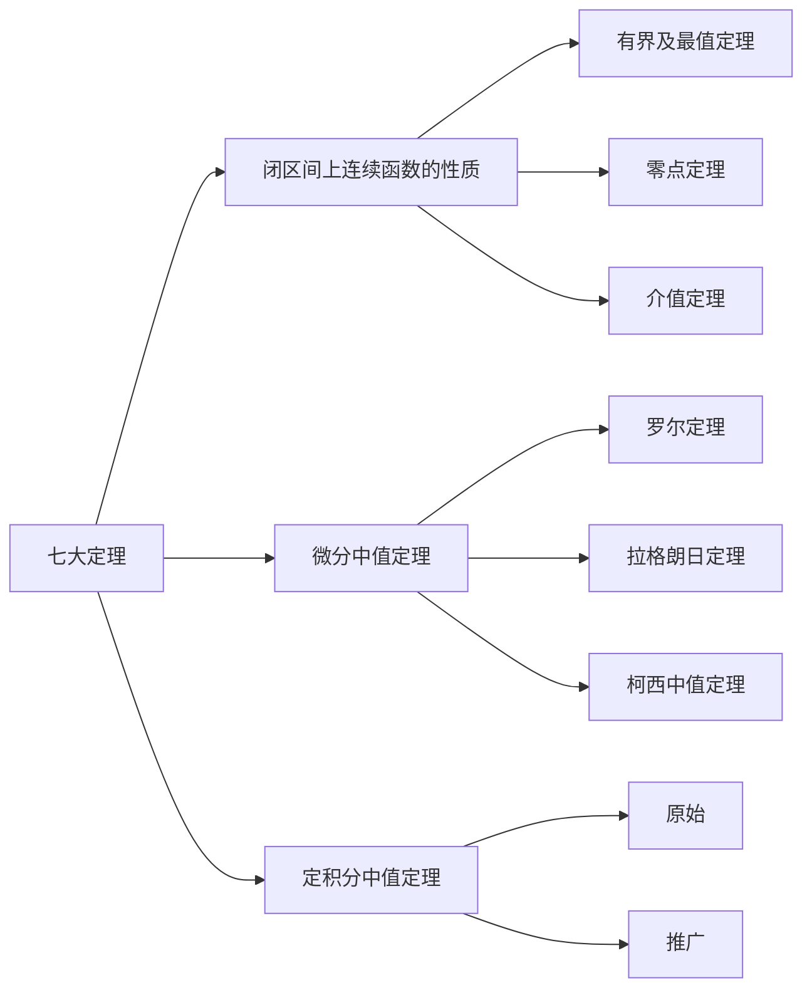

---
{"dg-publish":true,"dg-permalink":"数学/微分中值定理与导数的应用/微分中值定理","permalink":"/数学/微分中值定理与导数的应用/微分中值定理/","dgHomeLink":true,"dgPassFrontmatter":false}
---

# 罗尔定理
- 费马引理
	设函数$f(x)$在点$x_{0}$的某邻域$\mathring{U}(x_{0})$内有定义，并且在$x_{0}$处可导，如果对一任意的$x\in U(x_{0})$，有$$f(x)\leq f(x_{0})$$，那么$f'(x_{0})=0$
	- 证明：左右导数相等+极限保号性
- 导数为零的点：驻点/稳定点/临界点
- 罗尔定理
	如果函数$f(x)$满足：
	1.  在闭区间$[a,b]$上连续
	2. 在开区间$(a,b)$内可导
	3. 在区间端点处的函数值相等，$f(a)=f(b)$
	那么在$(a,b)$内至少有一点$\xi$，使得$f'({\xi})=0$
	- 证明：连续$\Rightarrow$最大值&最小值+两端相等+费马引理

# 拉格朗日中值定理
- 拉格朗日中值定理
	如果函数$f(x)$满足：
，l	1. 在闭区间$[a,b]$上连续
	2. 在开区间$(a,b)$内可导
	那么在$(a,b)$内至少有一点$\xi$，使不等式$$f(b)-f(a)=f'(\xi)(b-a)$$成立
	- 证明：构造函数$\varphi(x)=f(x)-f(a)-\frac{{f(b)-f(a)}}{b-a}(x-a)$+罗尔定理
- 有限增量定理$$\Delta y=f'(x+\theta\Delta x)\cdot\Delta x,(0<\delta<1)$$
	- 如果函数$f(x)$在区间$I$上连续，$I$内可导且导数恒为零，那么$f(x)$在区间$I$上是一个常数

# 柯西中值定理
- 柯西中值定理
	如果函数$f(x)$及$F(x)$满足：
	1. 在闭区间$[a,b]$上连续
	2. 在开区间$(a,b)$上可导
	3. 对任意$x\in(a,b)$，$F'(x)\neq 0$
	那么在$(a,b)$至少有一点$\xi$，使等式$$\frac{{f(b)-f(a)}}{F(b)-F(a)}=f'(\xi)-F'(\xi)$$成立
	- 证明：辅助函数$\varphi(x)=f(x)-\frac{{f(b)-f(a)}}{F(b)-F(a)}F(x)$+罗尔定理

