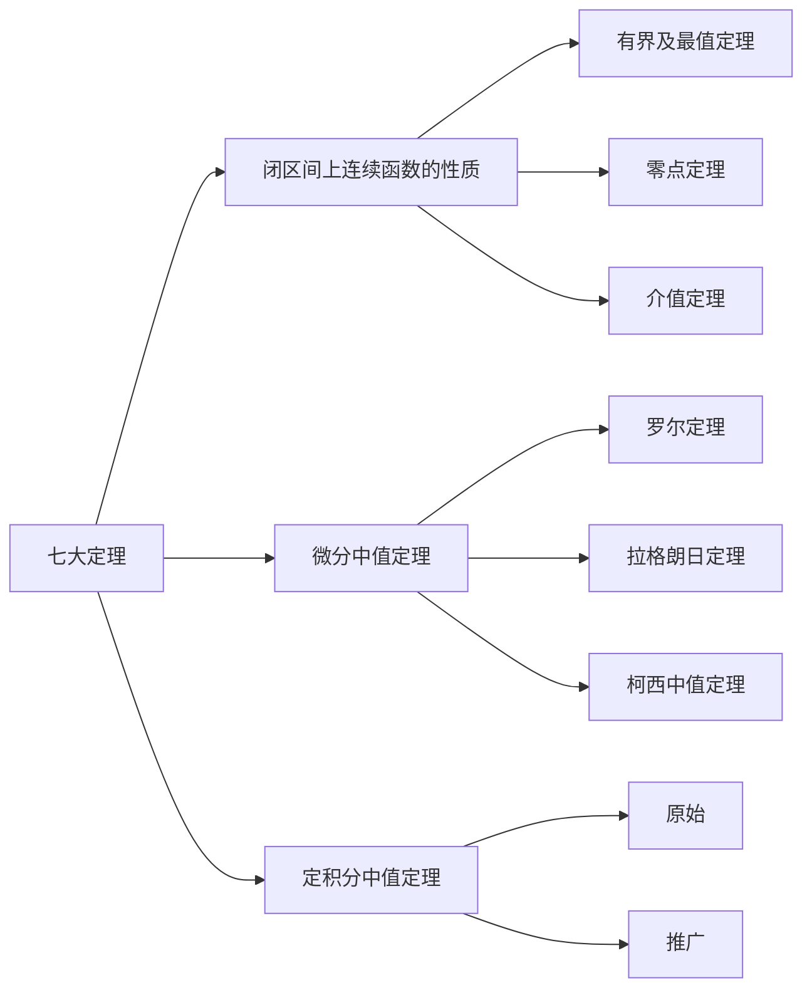

---
{"dg-publish":true,"dg-permalink":"数学/微分中值定理与导数的应用/微分中值定理","permalink":"/数学/微分中值定理与导数的应用/微分中值定理/","dgHomeLink":true,"dgPassFrontmatter":false}
---

- 有界及最值定理 [[数学/函数与极限/闭区间上连续函数的性质#^405221|闭区间上连续函数的性质#^405221]]
	- $f(x)\in C[a,b]$，则
		- $\exists M>0$使得$|f(x)|\leq M$
		- $\exists m, M$使得$m\leq f(x)\leq M$
- 零点定理 [[数学/函数与极限/闭区间上连续函数的性质#^6c205b|闭区间上连续函数的性质#^6c205b]]
	- $f(x)\in C[a,b]$，$f(a)f(b)<0$，则$\exists \xi \in (a,b)$使得$f(\xi)=0$
- 介值定理 [[数学/函数与极限/闭区间上连续函数的性质#^1a5dfb|闭区间上连续函数的性质#^1a5dfb]]
	- $f(x)\in C[a,b]$，则$\exists m,M$使得$m\leq f(x)\leq M$，$\forall c\in [m,M]$，$\exists\xi \in \color{red}{[a,b]}$使得$f(\xi)=C$
- 定积分中值定理
	- $f(x)\in C[a,b]$，则$\exists \begin{cases}\xi\in[a,b]\\ \xi \in (a,b)\end{cases}$使得$\int_{a}^{b} f(x) \, \mathrm{d}x=f(\xi)(b-a)$
	- 原始用介值定理证明，推广用拉格朗日
- 广义积分中值定理
	- $f(x)\in C[a,b]$，则$\xi\in(a,b)\int_{a}$使得$^{b} f(x)g(x) \, \mathrm{d}x=f'(\xi)\int_{a}^{b} g(x) \, \mathrm{d}x$
	- 
# 罗尔定理
- 费马引理
	设函数$f(x)$在点$x_{0}$的某邻域$\mathring{U}(x_{0})$内有定义，并且在$x_{0}$处可导，如果对一任意的$x\in U(x_{0})$，有$$f(x)\leq f(x_{0})$$，那么$f'(x_{0})=0$
	- 证明：左右导数相等+极限保号性
- 导数为零的点：驻点/稳定点/临界点
- 罗尔定理
	如果函数$f(x)$满足：
	1.  在闭区间$[a,b]$上连续
	2. 在开区间$(a,b)$内可导
	3. 在区间端点处的函数值相等，$f(a)=f(b)$
	那么在$(a,b)$内至少有一点$\xi$，使得$f'({\xi})=0$
	- 证明：连续$\Rightarrow$最大值&最小值+两端相等+费马引理

# 拉格朗日中值定理
- 拉格朗日中值定理
	如果函数$f(x)$满足：
	1. 在闭区间$[a,b]$上连续
	2. 在开区间$(a,b)$内可导
	那么在$(a,b)$内至少有一点$\xi$，使不等式$$f(b)-f(a)=f'(\xi)(b-a)$$成立
	- 证明：构造函数$\varphi(x)=f(x)-f(a)-\frac{ {f(b)-f(a)} }{b-a}(x-a)$+罗尔定理
- 有限增量定理$$\Delta y=f'(x+\theta\Delta x)\cdot\Delta x,(0<\delta<1)$$
	- 如果函数$f(x)$在区间$I$上连续，$I$内可导且导数恒为零，那么$f(x)$在区间$I$上是一个常数

# 柯西中值定理
- 柯西中值定理
	如果函数$f(x)$及$F(x)$满足：
	1. 在闭区间$[a,b]$上连续
	2. 在开区间$(a,b)$上可导
	3. 对任意$x\in(a,b)$，$F'(x)\neq 0$
	那么在$(a,b)$至少有一点$\xi$，使等式$$\frac{ {f(b)-f(a)} }{F(b)-F(a)}=f'(\xi)-F'(\xi)$$成立
	- 证明：辅助函数$\varphi(x)=f(x)-\frac{ {f(b)-f(a)} }{F(b)-F(a)}F(x)$+罗尔定理

# 题型

## $f^{(n)}(\xi)=0$
- 函数值之和$\Rightarrow$介值定理
- $\frac{1}{b-a}\int_{a}^{b} f(x) \, \mathrm{d}x$$\Rightarrow$定积分中值定理
- 3点2拉$\Rightarrow$拉格朗日定理加罗尔定理
- $f'(a)>0\ or\ f'(a)<0$$\Rightarrow$导数定义加极限保号性
- 不等式$\Rightarrow$零点定理
- $f(x)$可导，且有最大最小值$\Rightarrow$费马定理

## 结论中只有$\xi$，且导数阶差$=$${1}$
- 过程（当作微分方程求解以构造函数）
	1. $\xi\to x$
	2. 高阶在下
	3. 两边积分

## 结论中只有$\xi$，且导数阶差$\geq{2}$
- $f'(x)+kf(x)=0\Rightarrow F(x)=e^{kx}f(x)$
- $f(x)g'(x)+f'(x)g(x)=0\Rightarrow F(x)=f(x)g(x)$
- $f(x)g''(x)-f''(x)g(x)=0\Rightarrow F(x)=f(x)g'(x)-f'(x)g(x)$
- $f''(x)-f(x)=0\Rightarrow \begin{cases}F(x)=e^{-x}(f'(x)+f(x))\\F(x)=e^{x}(f'(x)-f(x))\end{cases}$
- $f'''(x)-f(x)=0\Rightarrow F(x)=e^{-x}(f''(x)+f'(x)+f(x))$

## 结论中有分离的$\xi$，a，b
- 过程
	- 将$\xi$与a、b分离
	- 根据a、b端的结构看使用拉格朗日定理或柯西中值定理

## 结论中有不可分离的$\xi$，a，b
- $$拆分重组\begin{cases}
+\Rightarrow(uv)'\\
-\Rightarrow\left( \frac{u}{v} \right)'
\end{cases}
\Rightarrow
\begin{cases}
1. &\quad 微分方程\\
2. &\quad中值定理构造辅助函数\\
3. &\quad 全微分方程
\end{cases}$$

## 双中值，结论中有$f'(\xi)$，$f'(\eta)$
- 3点2拉
- 过程
	- 假设第一个中值为$c$
	- 左右获得两个新中值，代入结论
	- 得到关于$c$的方程，构造函数

## 双中值，结论中除$f'(\xi)$，$f'(\eta)$有其他$\xi$，$\eta$成分
- 拉格朗日加柯西中值定理/两次拉格朗日
- 过程
	- 分离变量
	- 凑柯西

## 不等式的证明